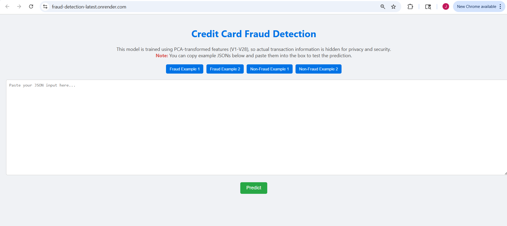
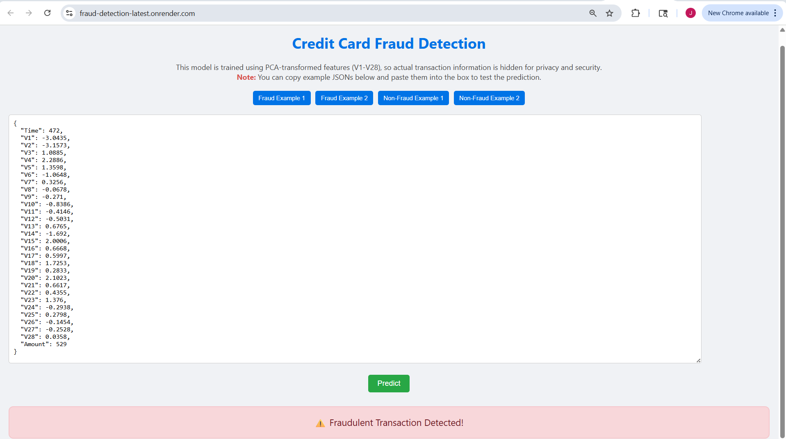
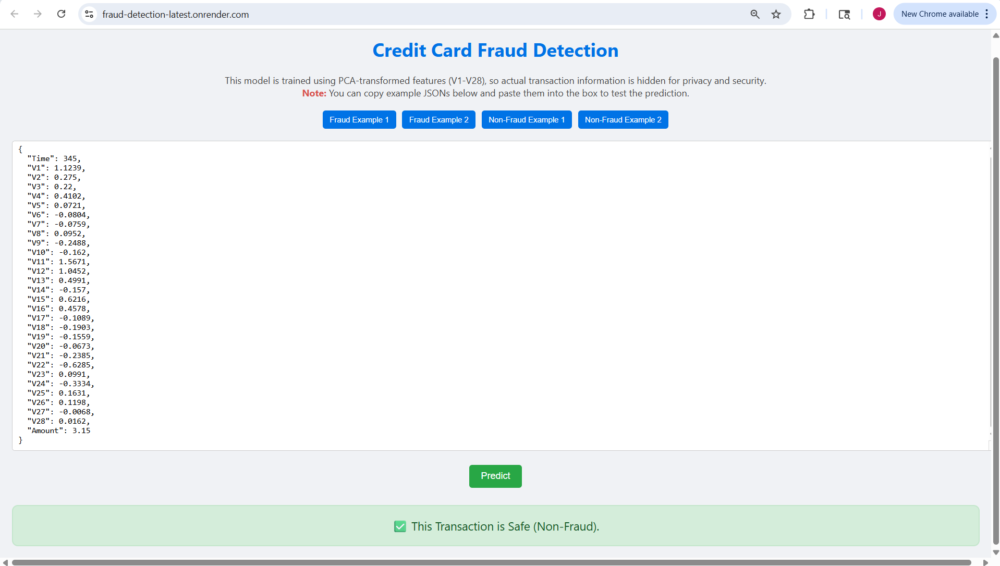

# 🚀 Credit Card Fraud Detection – From Raw Data to Final Model

**Live Demo:** [https://fraud-detection-latest.onrender.com/](https://fraud-detection-latest.onrender.com/)

## 📖 Project Story

Fraud detection is not just a machine learning problem — it’s a **high‑stakes, real‑world challenge** where missing a fraud (false negative) can cost thousands, and wrongly flagging a transaction (false positive) can damage customer trust.  
In this project, we tackled the **highly imbalanced** Credit Card Fraud Detection dataset, going step‑by‑step to build, test, and optimize models, just like in a real data science workflow.

---

## 📊 Dataset Overview

- **Rows:** 284,807  
- **Columns:** 31 (`Time`, `Amount`, `Class`, and PCA-transformed features `V1`–`V28`)  
- **Class Distribution:**  
  - Class `0` (Non-Fraud): 284,315  
  - Class `1` (Fraud): 492  
- **Time Feature:** Seconds elapsed from the first transaction in the dataset (spans ~48 hours).  
- **Amount Feature:** Transaction amount in dollars.

---

## ⚠️ Challenges

1. **Extreme Class Imbalance** – Only 0.17% fraud cases.
2. **PCA Features** – Hard to interpret directly.
3. **No Customer IDs** – Transactions are from different customers over 2 days.
4. **Evaluation Metrics** – Accuracy is misleading; we focus on **Recall, Precision, F1, and AUC-ROC**.

---

## 🛠 Step-by-Step Approach

### **1️⃣ Data Understanding & Preprocessing**
- Explored time and amount distributions.
- Extracted `Hour` from `Time`.
- Applied **cyclic encoding** to `Hour` (`sin` & `cos`) to preserve temporal continuity.
- **Standard Scaled** `Time` and `Amount` **after train-test split** to prevent data leakage.

---

### **2️⃣ Handling Class Imbalance**
We tested multiple resampling techniques:

| Technique            | Observation                              |
|----------------------|------------------------------------------|
| **SMOTE**            | High recall, very low precision.         |
| **Borderline-SMOTE** | Balanced, but lower recall than SMOTE.   |
| **ADASYN**           | Very high recall, too many false alarms. |
| **SMOTEENN**         | Similar to SMOTE, minor improvements.    |

---

### **3️⃣ Baseline Models**
We trained **Logistic Regression** and checked different resampling strategies.  
Findings:
- SMOTE: Recall ≈ 0.87, Precision ≈ 0.05
- Borderline-SMOTE: Recall ≈ 0.82, Precision ≈ 0.38
- ADASYN: Recall ≈ 0.92, Precision ≈ 0.02

---

### **4️⃣ Tree-Based Models**
- **Random Forest + Borderline-SMOTE**: Good balance (Precision ≈ 0.64, Recall ≈ 0.76).
- **XGBoost + Borderline-SMOTE**: Best balance so far (Precision ≈ 0.91, Recall ≈ 0.78, F1 ≈ 0.84, AUC ≈ 0.971).

---

### **5️⃣ Native Imbalance Handling**
- Trained **XGBoost with `scale_pos_weight`** (no oversampling).
- Result: Higher recall (0.84) but lower precision (0.22), AUC ≈ 0.976.
- Applied **threshold tuning** to boost precision to 0.47 while keeping recall at 0.82.

---

### **6️⃣ Final Ensemble**
We combined:
1. **XGBoost + Borderline-SMOTE** (Precision-heavy)
2. **XGBoost + Native Weight (tuned)** (Recall-heavy)

**Method:** Averaged predicted probabilities and tuned threshold.

**Threshold Tuning Results:**

| Threshold | Precision | Recall | F1   | FP  | FN  |
|-----------|-----------|--------|------|-----|-----|
| 0.40      | 0.48      | 0.81   | 0.61 | 82  | 18  |
| 0.45      | 0.63      | 0.80   | 0.70 | 45  | 19  |
| **0.50**  | 0.82      | 0.80   | 0.81 | 17  | 19  |
| **0.55**  | 0.89      | 0.80   | 0.84 | 9   | 19  |
| 0.65      | **0.91**  | 0.79   | 0.85 | 7   | 20  |

**Final Choice:** Threshold = **0.55** → **Precision 0.89**, **Recall 0.80**, **F1 0.84**, **AUC 0.976**.

---

## 🏆 Final Model Leaderboard

| Model & Data                               | Precision (Fraud) | Recall (Fraud) | F1-Score | AUC-ROC |
|--------------------------------------------|-------------------|----------------|----------|---------|
| Logistic Regression + SMOTE                | 0.05              | 0.87           | 0.10     | 0.967   |
| Logistic Regression + Borderline-SMOTE     | 0.38              | 0.82           | 0.52     | 0.909   |
| Logistic Regression + ADASYN               | 0.02              | 0.92           | 0.04     | 0.917   |
| Logistic Regression + SMOTEENN              | 0.05              | 0.87           | 0.09     | 0.966   |
| Random Forest + Borderline-SMOTE           | 0.64              | 0.76           | 0.70     | 0.964   |
| **XGBoost + Borderline-SMOTE**              | **0.91**          | 0.78           | **0.84** | 0.971   |
| XGBoost Native Weight                      | 0.22              | **0.84**       | 0.35     | **0.976** |
| **Ensemble (Final)**                        | 0.89              | 0.80           | 0.84     | 0.976   |

## Local Deployment SS:
   - _Landing Page_
  
   - _Fraud_
  
   - _Non-Fraud_
  

---

## 📌 Key Takeaways
- **Accuracy is meaningless** for highly imbalanced problems; focus on Recall, Precision, F1, AUC-ROC.
- **Cyclic encoding** is essential for time-of-day features.
- **Oversampling** can help but may introduce noise; try **model-based imbalance handling** too.
- **Ensembling complementary models** can balance recall and precision effectively.
- **Threshold tuning** is as important as model selection.

---

💡 *Fraud detection is not about finding a single perfect model — it’s about balancing trade-offs between catching as many frauds as possible and minimizing false alarms. This project shows how a systematic, step-by-step approach can lead to a robust real-world solution.*
